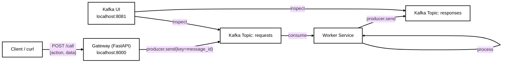

# Kafka Learning Lab

> A minimal event-driven gateway built with Apache Kafka, FastAPI, and Docker Compose.
> This project was created as a hands-on learning lab to understand Kafka's log-based
> messaging model after coming from a RabbitMQ background.
>
> เอกสารการเรียนรู้แบบ Step-by-step ภาษาไทยอยู่ใน [`docs/`](docs/).

## About

This repository sets up a small Kafka-based messaging system:

- An **HTTP Gateway** (FastAPI) receives requests via `POST /call` and publishes them to a Kafka topic.
- A **Worker Service** consumes the topic, processes the message, and writes a response back to another topic.
- **Kafka UI** provides a web interface to inspect topics, messages, partitions and consumer groups.
- Everything runs locally with a single `docker compose up` command.

The goal is to learn core Kafka concepts — topics, partitions, offsets, consumer groups,
and advertised listeners — by running real code instead of only reading documentation.

## Motivation

I had used RabbitMQ before and wanted to understand how Kafka differs. RabbitMQ feels like
queues with exchanges and routing, while Kafka feels like a distributed append-only log.
This project helped me compare the two directly and understand when to choose one over the other.

Key questions I wanted to answer:

- How does message persistence and replay work in Kafka?
- What is the difference between a queue and a consumer group?
- How do partitions and offsets affect ordering and parallelism?
- How do you connect to Kafka from inside Docker vs. from the host machine?

## What I Learned

- **Kafka is a log, not a queue**: messages are persisted and can be replayed by any consumer group.
- **Ordering is per-partition**: messages inside one partition are ordered; across partitions they are not.
- **Consumer groups share partitions**: multiple consumers in the same group split the partitions. Separate groups read independently.
- **Listeners matter**: services inside Docker connect to `broker:29092`, while the host machine uses `localhost:9092`.
- **Health checks need care**: `producer.bootstrap_connected()` can return `false` after an idle timeout even though the producer reconnects automatically. I changed the gateway to use `producer.partitions_for(topic)` for a more reliable check.
- **Python client trade-offs**: `kafka-python-ng` is easy to set up for learning, but `confluent-kafka-python` is better for production throughput.

## Tech Stack

- Apache Kafka (Confluent Platform `7.6.1`)
- Zookeeper
- FastAPI (Gateway)
- Python + `kafka-python-ng` (Worker & examples)
- Docker & Docker Compose
- Kafka UI (`provectuslabs/kafka-ui`)
- GitHub Actions (CI validation)

## Architecture



## Quick Start

### Prerequisites

- Docker Desktop (WSL2 backend recommended on Windows)
- Docker Compose v2.20+ (supports `depends_on` conditions)

### Run everything

```bash
docker compose up -d --build
```

Wait a few seconds for Zookeeper, Kafka and the topic initialization to finish.

### Verify the gateway

```bash
curl http://localhost:8000/health
```

Expected output:

```json
{"status":"ok","kafka_connected":true}
```

### Send a request through the gateway

```bash
curl -X POST http://localhost:8000/call \
  -H "Content-Type: application/json" \
  -d '{"action":"greet","data":{"name":"krisa"}}'
```

Expected output:

```json
{
  "status": "queued",
  "message_id": "xxxxxxxx-xxxx-xxxx-xxxx-xxxxxxxxxxxx",
  "topic": "requests",
  "partition": 0,
  "offset": 0
}
```

### Watch the worker process the message

```bash
docker compose logs -f worker
```

You should see the worker receive the request and produce a response to the `responses` topic.

### Explore Kafka UI

Open [http://localhost:8081](http://localhost:8081) and browse:

- **Topics**: `requests`, `responses`, `demo-topic`
- **Messages**: payload, key, offset and partition
- **Consumer Groups**: current offset and lag

## Project Structure

```
.
├── docker-compose.yml
├── .env
├── .gitignore
├── README.md
├── gateway/
│   ├── Dockerfile
│   ├── main.py
│   └── requirements.txt
├── service/
│   ├── Dockerfile
│   ├── worker.py
│   └── requirements.txt
├── examples/
│   ├── producer.py
│   ├── consumer.py
│   └── requirements.txt
└── docs/
    ├── 01-kafka-basics.md
    ├── 02-architecture.md
    └── 03-lessons-learned.md
```

## Learning Path

If you are new to Kafka, follow the guides in order:

1. [01 - Kafka Basics (Thai)](docs/01-kafka-basics.md)
2. [02 - Architecture](docs/02-architecture.md)
3. [03 - Lessons Learned](docs/03-lessons-learned.md)

## Common Commands

```bash
# Start the stack
docker compose up -d --build

# View logs
docker compose logs -f broker
docker compose logs -f worker

# Stop the stack
docker compose down

# Stop and remove all data (volumes)
docker compose down -v
```

## Kafka Connection

- **Inside Docker network**: use `broker:29092`
- **From the host machine**: use `localhost:9092`

This is configured by `KAFKA_ADVERTISED_LISTENERS` in `docker-compose.yml`.

## Future Improvements

- Replace Zookeeper with KRaft mode
- Add Schema Registry for Avro / JSON Schema validation
- Add Kafka Streams or ksqlDB for stream processing
- Add multiple Kafka brokers for real HA
- Switch Python gateway/worker to `confluent-kafka-python` for higher throughput
