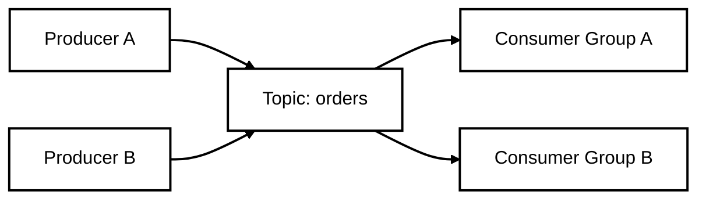

# เรียน Kafka ทีละ Step

เอกสารนี้สอนตั้งแต่ศูนย์จนถึงใช้ Kafka เป็น front-facing messaging layer แบบที่โปรเจกต์นี้ทำ ถ้าเคยใช้ RabbitMQ มาก่อน จะมีเปรียบเทียบให้ฟังตลอด

---

## Step 0: Kafka คืออะไร และต่างจาก RabbitMQ ยังไง

### Kafka คืออะไร

Kafka เป็น **Distributed Event Streaming Platform** หรือพูดง่าย ๆ คือ **ระบบบันทึก log ของเหตุการณ์ (event) แบบกระจาย** ที่ทำให้แอปฯ หลาย ๆ ตัวส่งข้อความให้กันได้แบบ real-time และเก็บข้อความย้อนหลังได้

### เปรียบเทียบกับ RabbitMQ

| หัวข้อ | RabbitMQ | Kafka |
|---|---|---|
| แนวคิด | Queue + Exchange | Distributed Commit Log |
| Producer ส่งไปไหน | Exchange แล้ว route ไป Queue | Topic |
| Consumer ทำอะไร | ดึงข้อความออกจาก Queue | อ่าน log จาก Topic/Partition ที่ offset ใด offset หนึ่ง |
| ข้อความหายมั้ยหลัง consume | หาย (ถ้า ack แล้ว) | ไม่หาย เก็บตาม retention |
| Replay ย้อนหลังได้มั้ย | ยาก | ได้เลย |
| Consumer หลายกลุ่ม | ต้อง bind queue หลายอัน | ใช้ Consumer Group แยกกันอ่านได้ |
| จุดเด่น | Routing ละเอียด, RPC, Task Queue | High throughput, Event streaming, Replay |

### ศัพท์สำคัญที่ต้องจำ

- **Broker**: ตัว Kafka server เอง คอยรับ/ส่งข้อความ ใน production มักมีหลาย broker
- **Topic**: ช่องทางส่งข้อความ เหมือน category หรือชื่อ log
- **Partition**: Topic ถูกแบ่งเป็น partition หลาย ๆ ชิ้น ทำให้กระจาย load และ parallel ได้
- **Offset**: ตำแหน่งของข้อความใน partition คล้ายเลขหน้าในหนังสือ
- **Producer**: ตัวส่งข้อความ
- **Consumer**: ตัวอ่านข้อความ
- **Consumer Group**: กลุ่ม consumer ที่ร่วมกันอ่าน topic โดยแบ่งกันกิน partition
- **Zookeeper/KRaft**: ตัวจัดการ metadata และเลือก controller ของ Kafka (ในโปรเจกต์นี้ใช้ Zookeeper)



---

## Step 1: รัน Kafka stack นี้

เปิด terminal แล้วรัน:

```bash
cd C:\Users\krisa\Desktop\kafka
docker compose up -d --build
```

ตรวจสอบว่า container ทุกตัว Up:

```bash
docker compose ps
```

ทดสอบ Gateway:

```bash
curl http://localhost:8000/health
```

ส่งคำขอผ่าน Gateway:

```bash
curl -X POST http://localhost:8000/call \
  -H "Content-Type: application/json" \
  -d '{"action":"hello","data":{"name":"krisa"}}'
```

ดูผลลัพธ์ของ Worker:

```bash
docker compose logs -f worker
```

เปิด Kafka UI ใน browser:

```
http://localhost:8081
```

---

## Step 2: ใช้ Kafka CLI เบื้องต้น

เข้าไปใน container ของ Kafka broker:

```bash
docker exec -it kafka-broker bash
```

### ดู topic ทั้งหมด

```bash
kafka-topics --bootstrap-server broker:29092 --list
```

### สร้าง topic ใหม่

```bash
kafka-topics \
  --create \
  --topic demo-topic \
  --bootstrap-server broker:29092 \
  --partitions 3 \
  --replication-factor 1
```

### ดูรายละเอียด topic

```bash
kafka-topics --bootstrap-server broker:29092 --describe --topic demo-topic
```

### ส่งข้อความด้วย console producer

```bash
kafka-console-producer \
  --topic demo-topic \
  --bootstrap-server broker:29092
```

พิมพ์ข้อความแล้วกด Enter แต่ละบรรทัดจะกลายเป็น 1 message

### อ่านข้อความด้วย console consumer

เปิด terminal อีกอันเข้าไปใน broker แล้วรัน:

```bash
kafka-console-consumer \
  --topic demo-topic \
  --from-beginning \
  --bootstrap-server broker:29092
```

`--from-beginning` จะอ่านทุกข้อความตั้งแต่ offset แรก

---

## Step 3: เขียน Producer / Consumer ด้วย Python

ตัวอย่างไฟล์อยู่ใน `examples/`

### ติดตั้ง library

```bash
pip install -r examples/requirements.txt
```

### Producer

ไฟล์ `examples/producer.py`:

```python
import json
import time
from kafka import KafkaProducer

producer = KafkaProducer(
    bootstrap_servers=["localhost:9092"],
    value_serializer=lambda v: json.dumps(v, ensure_ascii=False).encode("utf-8"),
    key_serializer=lambda k: k.encode("utf-8") if k else None,
)

topic = "demo-topic"

for i in range(10):
    key = f"user-{i % 3}"
    msg = {"no": i, "hello": "สวัสดี", "key": key}
    future = producer.send(topic, key=key, value=msg)
    record = future.get(timeout=10)
    print(f"sent {msg} -> partition={record.partition} offset={record.offset}")
    time.sleep(0.5)

producer.flush()
producer.close()
```

### Consumer

ไฟล์ `examples/consumer.py`:

```python
import json
from kafka import KafkaConsumer

consumer = KafkaConsumer(
    "demo-topic",
    bootstrap_servers=["localhost:9092"],
    group_id="demo-group",
    auto_offset_reset="earliest",
    value_deserializer=lambda m: json.loads(m.decode("utf-8")),
    key_deserializer=lambda m: m.decode("utf-8") if m else None,
)

print("กำลังฟัง topic: demo-topic ... กด Ctrl+C เพื่อหยุด")
try:
    for msg in consumer:
        print(f"partition={msg.partition} offset={msg.offset} key={msg.key} value={msg.value}")
except KeyboardInterrupt:
    consumer.close()
```

### ลองรัน

เปิด terminal 2 อัน:

- อันแรก: `python examples/consumer.py`
- อีกอัน: `python examples/producer.py`

สังเกตว่า consumer ได้รับข้อความตามลำดับไหม แล้ว `partition` กับ `offset` เป็นอย่างไร

---

## Step 4: เข้าใจ Partition และ Offset

### Partition คืออะไร

- Topic หนึ่ง topic แบ่งเป็น partition ได้หลาย partition
- แต่ละ partition เป็น log อิสระ มีลำดับข้อความของตัวเอง
- ข้อความใน partition เดียวกัน มี **ลำดับ (ordering)** แน่นอน
- ข้อความข้าม partition ไม่มีการรับประกันลำดับ

### Offset คืออะไร

- ตำแหน่งของข้อความใน partition
- ค่าเริ่มต้นที่ 0
- Consumer จะเก็บ state ว่าอ่านถึง offset ไหนแล้ว (commit offset)

### Key มีผลต่อ Partition

ถ้า `producer.send(topic, key="user-1", value=...)` Kafka จะเอา key ไป hash แล้วเลือก partition ให้ key เดิมตก partition เดิมเสมอ

- ข้อดี: ข้อความของ user เดียวกันเรียงลำดับในที่เดียวกัน
- ข้อควรระวัง: ถ้า key ไม่สมดุล บาง partition อาจร้อนขึ้น (hot partition)

ลองแก้ `producer.py` ให้ส่ง key เหมือนกันทั้งหมด แล้วดูว่าข้อความทั้งหมดไป partition เดียวกันรึเปล่า

---

## Step 5: Consumer Group

### Consumer Group คืออะไร

- กลุ่ม consumer ที่มี `group_id` เดียวกัน จะร่วมกันอ่าน topic
- แต่ละ partition ใน topic จะถูกอ่านโดย consumer **หนึ่งตัว** ในกลุ่มนั้น
- ถ้ามี consumer มากกว่า partition บางตัวจะว่างเปล่า
- Consumer group ต่างกัน อ่านข้อมูลเดียวกันได้อิสระ (offset แยกกันเก็บ)

### ทดลอง

1. เปิด terminal แล้วรัน consumer group `demo-group` 2-3 อัน

```bash
python examples/consumer.py
```

2. รัน producer ส่งข้อความ

สังเกตว่า Kafka จะแบ่ง partition ให้แต่ละ consumer โดยอัตโนมัติ (rebalance)

3. เปิด consumer อีก group หนึ่ง โดยแก้ `group_id` เป็น `"demo-group-2"`

group นี้จะอ่านข้อความเดิมได้ทั้งหมดเหมือนกัน เพราะ offset แยกกันเก็บ

---

## Step 6: สำรวจ Kafka UI

เปิด `http://localhost:8081` แล้วลองดู:

- **Topics**: มี topic อะไรบ้าง แต่ละ topic มีกี่ partition
- **Messages**: คลิกเข้า topic `demo-topic` ดูข้อความที่ producer ส่งไป
- **Consumer Groups**: ดูว่า `demo-group` อ่านถึง offset ไหนแล้ว มี lag เท่าไหร่
- **Brokers**: ดูว่ามี broker กี่ตัว ออนไลน์หรือไม่

---

## Step 7: สรุปและแนวทางต่อไป

ตอนนี้คุณรู้แล้วว่า:

- Kafka ทำงานแบบ log ไม่ใช่ queue
- Topic / Partition / Offset / Consumer Group ทำงานอย่างไร
- ส่ง/รับข้อความผ่าน CLI และ Python
- ดูข้อมูลผ่าน Kafka UI

### แนวทางต่อไป

| หัวข้อ | คำอธิบาย |
|---|---|
| **Kafka Connect** | ต่อ Kafka กับ database / file / API โดยไม่ต้องเขียนโค้ด |
| **Kafka Streams** | ประมวลผล stream ภายใน JVM ได้ stateful processing |
| **Schema Registry** | จัดการ Avro / JSON Schema ให้ producer/consumer ตกลง format |
| **ksqlDB** | Query Kafka topic ด้วย SQL |
| **KRaft** | Kafka แบบไม่ใช้ Zookeeper ในอนาคต |

---

## คำสั่งที่ใช้บ่อย

```bash
# รันทั้งหมด
docker compose up -d --build

# ดู log
docker compose logs -f broker
docker compose logs -f worker

# หยุดทั้งหมด
docker compose down

# ลบข้อมูลทั้งหมดด้วย
docker compose down -v
```
