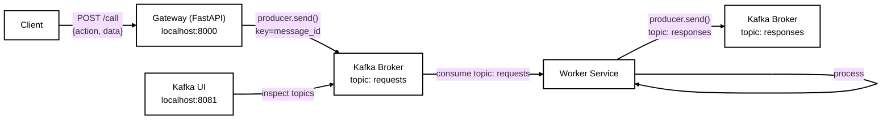

# Architecture

This project demonstrates a minimal event-driven gateway using Kafka as the messaging backbone.

## Components

| Service | Role | Port |
|---|---|---|
| `zookeeper` | Kafka metadata coordinator | internal only |
| `broker` | Kafka broker | `9092` on host, `29092` inside Docker network |
| `init-kafka` | One-shot job that creates `requests` and `responses` topics | internal only |
| `kafka-ui` | Web UI for browsing topics, messages and consumer groups | `8081` |
| `gateway` | FastAPI HTTP entrypoint that publishes to Kafka | `8000` |
| `worker` | Background consumer that processes requests and writes responses | internal only |

## Message Flow



## Listeners

- **External clients** on the Windows/macOS/Linux host connect to Kafka via `localhost:9092`
- **Services running inside Docker** connect via `broker:29092`

The advertised listener configuration is:

```yaml
KAFKA_ADVERTISED_LISTENERS: PLAINTEXT://broker:29092,PLAINTEXT_HOST://localhost:9092
```

## Why a gateway?

Instead of exposing Kafka directly to every client, the `gateway` provides a stable HTTP contract. Clients only need to know REST, while the gateway handles Kafka producer semantics such as partitioning, retries, and serialization.
